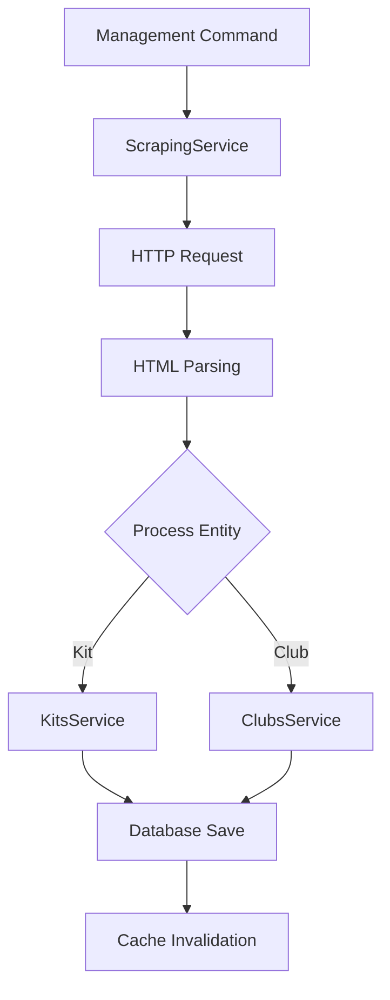

## Overview

FKApi is a Django REST API built to provide structured access to football kit data. The system follows a layered architecture pattern with clear separation of concerns across presentation, business logic, and data access layers.

## Architecture Diagram

```
┌─────────────────────────────────────────────────────────────┐
│                        Client Layer                          │
│  (Web Browsers, Mobile Apps, API Clients)                   │
└────────────────────────┬────────────────────────────────────┘
                         │
                         ▼
┌─────────────────────────────────────────────────────────────┐
│                      Django Application                      │
│  ┌──────────────────────────────────────────────────────┐  │
│  │              URL Routing (urls.py)                    │  │
│  └──────────────────┬───────────────────────────────────┘  │
│                     │                                        │
│  ┌──────────────────▼───────────────────────────────────┐  │
│  │              Middleware Layer                          │  │
│  │  • Rate Limiting                                       │  │
│  │  • Performance Monitoring                             │  │
│  └──────────────────┬───────────────────────────────────┘  │
│                     │                                        │
│  ┌──────────────────▼───────────────────────────────────┐  │
│  │              API Layer (Django Ninja)                  │  │
│  │  • REST API Endpoints                                 │  │
│  │  • Request Validation                                │  │
│  │  • Response Serialization                            │  │
│  └──────────────────┬───────────────────────────────────┘  │
│                     │                                        │
│  ┌──────────────────▼───────────────────────────────────┐  │
│  │              Service Layer                             │  │
│  │  • Business Logic                                     │  │
│  │  • Data Processing                                    │  │
│  │  • Scraping Service                                   │  │
│  └──────────────────┬───────────────────────────────────┘  │
│                     │                                        │
│  ┌──────────────────▼───────────────────────────────────┐  │
│  │              Data Access Layer                         │  │
│  │  • Django ORM                                         │  │
│  │  • Model Queries                                      │  │
│  └──────────────────┬───────────────────────────────────┘  │
└─────────────────────┼───────────────────────────────────────┘
                      │
                      ▼
┌─────────────────────────────────────────────────────────────┐
│                    Data Storage Layer                        │
│  ┌──────────────┐  ┌──────────────┐                       │
│  │  PostgreSQL  │  │    Redis     │                       │
│  │   Database   │  │    Cache     │                       │
│  └──────────────┘  └──────────────┘                       │
└─────────────────────────────────────────────────────────────┘
```

## Core Components

### 1. Client Layer

The entry point for all external interactions:
- Web browsers accessing the API
- Mobile applications
- Third-party API clients
- API testing tools (Postman, cURL)

### 2. URL Routing

Django's URL dispatcher maps incoming requests to appropriate endpoints:
- Defined in `fkapi/urls.py`
- Routes API requests to Django Ninja endpoints
- Handles admin interface routing

### 3. Middleware Layer

Two custom middleware components provide cross-cutting functionality:

<AccordionGroup>
  <Accordion title="Rate Limiting Middleware" icon="gauge-high">
    Prevents API abuse by limiting requests per IP address:
    - Tracks request counts per IP
    - Configurable rate limits
    - Whitelist support via `API_RATE_LIMIT_WHITELIST`
    - Returns 429 status code when limits exceeded
  </Accordion>
  
  <Accordion title="Performance Monitoring Middleware" icon="chart-line">
    Monitors application performance:
    - Tracks response times
    - Logs slow queries (threshold: `SLOW_QUERY_THRESHOLD`)
    - Identifies slow responses (threshold: `SLOW_RESPONSE_THRESHOLD`)
    - Optional database query logging via `LOG_DB_QUERIES`
  </Accordion>
</AccordionGroup>

### 4. API Layer (Django Ninja)

Django Ninja provides a modern, FastAPI-style API framework:
- RESTful endpoint definitions
- Automatic request validation using Pydantic
- Response serialization
- OpenAPI/Swagger documentation generation
- Type-safe API development

### 5. Service Layer

Business logic lives in service classes under `core/services/`:
- **ScrapingService**: Orchestrates web scraping operations
- **KitsService**: Handles kit-related business logic
- **ClubsService**: Manages club operations

This separation enables:
- Testable business logic
- Reusable components across endpoints
- Clear separation of concerns

### 6. Data Access Layer

Django ORM provides database abstraction:
- Model definitions in `core/models.py`
- Query optimization with `select_related()` and `prefetch_related()`
- Database indexes on frequently queried fields
- Transaction management

### 7. Data Storage

<CardGroup cols={2}>
  <Card title="PostgreSQL Database" icon="database">
    Primary data store for all structured data:
    - Clubs, Kits, Seasons
    - Brands, Competitions
    - Colors and Variations
    - Connection pooling enabled (`CONN_MAX_AGE: 60`)
    - Keepalive settings for connection stability
  </Card>
  
  <Card title="Redis Cache" icon="bolt">
    Optional caching layer:
    - Reduces database load
    - Stores API responses
    - Cache timeout configurations (5m to 24h)
    - Automatically enabled when Celery is active
    - Falls back to local memory cache if unavailable
  </Card>
</CardGroup>

<Note>
  Images (kit photos, logos) are stored as URLs pointing to footballkitarchive.com, not served locally.
</Note>

## Data Flow

### API Request Flow

<Steps>
  <Step title="Client Request">
    Client sends HTTP request to API endpoint
  </Step>
  
  <Step title="URL Routing">
    Django's URL dispatcher routes request to appropriate endpoint
  </Step>
  
  <Step title="Middleware Processing">
    Request passes through rate limiting and performance monitoring
  </Step>
  
  <Step title="API Endpoint">
    Django Ninja validates request and calls appropriate function
  </Step>
  
  <Step title="Service Layer">
    Business logic executes (validation, transformation)
  </Step>
  
  <Step title="Data Access">
    Django ORM queries database (checks cache first if enabled)
  </Step>
  
  <Step title="Database Query">
    PostgreSQL returns requested data
  </Step>
  
  <Step title="Response Serialization">
    Data serialized to JSON format
  </Step>
  
  <Step title="Middleware Response">
    Performance metrics logged, headers added
  </Step>
  
  <Step title="Client Response">
    JSON response returned to client
  </Step>
</Steps>

### Scraping Data Flow

The scraping process ingests data from footballkitarchive.com:



1. **Trigger**: Management command or Celery task initiates scraping
2. **HTTP Request**: `http_get()` fetches page with retry logic and proxy support
3. **HTML Parsing**: BeautifulSoup4 extracts structured data from HTML
4. **Data Processing**: Service layer validates and transforms data
5. **Database Save**: ORM creates or updates records within transactions
6. **Cache Invalidation**: Django signals clear affected cache entries

## Design Patterns

### Service Layer Pattern

Separates business logic from presentation layer:
- Located in `core/services/`
- Promotes code reusability
- Enhances testability
- Example: `ScrapingService.process_kit_data()`

### Repository Pattern

Implemented via Django ORM:
- Data access abstraction
- Custom model managers for complex queries
- Query optimization methods

### Middleware Pattern

Handles cross-cutting concerns:
- Rate limiting applies to all requests
- Performance monitoring on every response
- Executes before and after view processing

### Signal Pattern

Event-driven cache invalidation:
- Django signals trigger on model changes
- Automatic cache clearing on save/delete
- Maintains cache consistency

### Factory Pattern

Configurable object creation:
- HTTP session creation with proxy support
- Scraper configuration based on environment

## Technology Stack

<CardGroup cols={3}>
  <Card title="Django 5.0" icon="python">
    Web framework
  </Card>
  <Card title="Django Ninja" icon="bolt">
    REST API framework
  </Card>
  <Card title="PostgreSQL" icon="database">
    Primary database
  </Card>
  <Card title="Redis" icon="server">
    Cache layer
  </Card>
  <Card title="Celery" icon="clock">
    Task queue (optional)
  </Card>
  <Card title="BeautifulSoup4" icon="code">
    HTML parsing
  </Card>
</CardGroup>

## Configuration

Key environment variables from `settings.py`:

| Variable | Purpose | Default |
|----------|---------|--------|
| `DJANGO_DEBUG` | Debug mode | `True` |
| `DJANGO_SECRET_KEY` | Security key | Auto-generated in dev |
| `DJANGO_ALLOWED_HOSTS` | Allowed hosts | `localhost,127.0.0.1` |
| `ENABLE_CELERY` | Enable task queue | Based on availability |
| `USE_REDIS_CACHE` | Use Redis for caching | `False` |
| `SLOW_QUERY_THRESHOLD` | Slow query threshold (seconds) | `0.5` |
| `SLOW_RESPONSE_THRESHOLD` | Slow response threshold (seconds) | `1.0` |
| `API_RATE_LIMIT_WHITELIST` | Whitelisted IPs | None |

## Performance Optimizations

<AccordionGroup>
  <Accordion title="Caching Strategy" icon="bolt">
    Multi-tier caching with configurable timeouts:
    - `CACHE_TIMEOUT_SHORT`: 5 minutes
    - `CACHE_TIMEOUT_MEDIUM`: 30 minutes
    - `CACHE_TIMEOUT_LONG`: 1 hour
    - `CACHE_TIMEOUT_VERY_LONG`: 24 hours
  </Accordion>
  
  <Accordion title="Database Optimization" icon="database">
    - Connection pooling (`CONN_MAX_AGE: 60`)
    - Keepalive settings for connection stability
    - Indexes on frequently queried fields
    - `select_related()` and `prefetch_related()` for joins
  </Accordion>
  
  <Accordion title="Query Optimization" icon="magnifying-glass">
    - Database indexes on:
      - Club: name, country, slug
      - Kit: name, team+season, main_img_url, rating
      - Type_K: category_order, is_goalkeeper, order_priority
      - Competition: name, country
  </Accordion>
</AccordionGroup>

## Security Features

- **Rate Limiting**: Prevents API abuse
- **Optional API Key Authentication**: Via `ninja-apikey`
- **SQL Injection Protection**: Django ORM parameterized queries
- **XSS Protection**: Django template escaping
- **CSRF Protection**: Enabled for admin, disabled for API endpoints
- **Secure Headers**: In production mode:
  - `SECURE_SSL_REDIRECT`
  - `SESSION_COOKIE_SECURE`
  - `CSRF_COOKIE_SECURE`
  - `SECURE_HSTS_SECONDS`: 1 year
  - `X_FRAME_OPTIONS`: DENY

## Deployment Architecture

```
┌─────────────────────────────────────────────────────────────┐
│                      Load Balancer                           │
└────────────────────────┬────────────────────────────────────┘
                         │
         ┌───────────────┴───────────────┐
         │                               │
         ▼                               ▼
┌─────────────────┐           ┌─────────────────┐
│  Django App 1   │           │  Django App 2   │
│  (Gunicorn)     │           │  (Gunicorn)     │
└────────┬────────┘           └────────┬────────┘
         │                               │
         └───────────────┬───────────────┘
                         │
         ┌───────────────┴───────────────┐
         │                               │
         ▼                               ▼
┌─────────────────┐           ┌─────────────────┐
│   PostgreSQL    │           │     Redis      │
│   (Primary)     │           │     Cache      │
└─────────────────┘           └─────────────────┘
```

<Note>
  Multiple Django application instances can run behind a load balancer. Redis ensures cache consistency across instances.
</Note>

## Related Documentation

<CardGroup cols={2}>
  <Card title="Data Models" icon="diagram-project" href="/concepts/data-models">
    Learn about database models and relationships
  </Card>
  <Card title="Scraping Architecture" icon="spider" href="/concepts/scraping">
    Understand web scraping implementation
  </Card>
</CardGroup>
