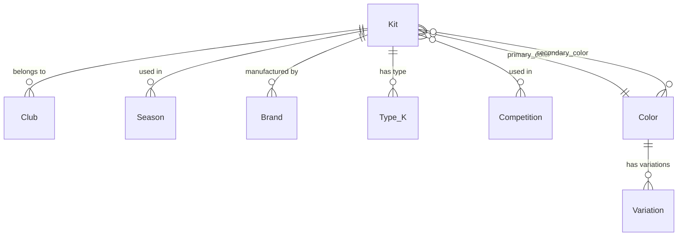

## Overview

FKApi uses Django ORM models to represent football kit data. The schema is designed to normalize data while maintaining query performance through strategic use of foreign keys, many-to-many relationships, and database indexes.

All models are defined in `fkapi/core/models.py`.

## Entity Relationship Diagram



## Core Models

### Kit

The central model representing a football kit (jersey/uniform).

<ParamField path="name" type="CharField(100)" required>
  Kit name (indexed for search performance)
</ParamField>

<ParamField path="slug" type="CharField(150)" required>
  URL-friendly identifier (unique). Allows special characters including Romanian characters (ăâîșț). Must match pattern: `[-a-zA-Z0-9_ăâîșțĂÂÎȘȚ]+`
</ParamField>

<ParamField path="kit_id" type="CharField(20)">
  Original ID from FootballKitArchive.com for URL construction
</ParamField>

<ParamField path="team" type="ForeignKey(Club)" required>
  Club that owns this kit
</ParamField>

<ParamField path="season" type="ForeignKey(Season)" required>
  Season this kit was used
</ParamField>

<ParamField path="competition" type="ManyToManyField(Competition)">
  Competitions this kit was used in
</ParamField>

<ParamField path="type" type="ForeignKey(Type_K)" required>
  Type of kit (Home, Away, Third, etc.)
</ParamField>

<ParamField path="brand" type="ForeignKey(Brand)" required>
  Manufacturer/brand of the kit
</ParamField>

<ParamField path="main_img_url" type="URLField" required>
  URL to main kit image
</ParamField>

<ParamField path="rating" type="DecimalField(3,2)" required>
  User rating (0.00-10.00)
</ParamField>

<ParamField path="fh_link" type="URLField">
  Link to FootyHeadlines.com
</ParamField>

<ParamField path="web_updated" type="DateTimeField">
  Last update time from source website
</ParamField>

<ParamField path="last_updated" type="DateTimeField">
  Last update time in database (auto-updated)
</ParamField>

<ParamField path="primary_color" type="ForeignKey(Color)">
  Primary color of the kit
</ParamField>

<ParamField path="secondary_color" type="ManyToManyField(Color)">
  Secondary colors of the kit
</ParamField>

<ParamField path="design" type="CharField(100)">
  Design description or pattern name
</ParamField>

#### Indexes

Kit model has the following database indexes for query optimization:
- `name` (single field)
- `team, season` (composite)
- `main_img_url` (single field)
- `web_updated` (single field)
- `last_updated` (single field)
- `rating` (single field)

<CodeGroup>
```python Example Query
from core.models import Kit

# Get all home kits for a specific club in 2024 season
kits = Kit.objects.filter(
    team__slug='manchester-united',
    season__first_year='2024',
    type__name='Home'
).select_related('team', 'season', 'brand', 'type')
```

```python With Related Data
# Get kit with all relationships loaded
kit = Kit.objects.select_related(
    'team', 'season', 'brand', 'type', 'primary_color'
).prefetch_related(
    'competition', 'secondary_color'
).get(slug='kit-slug-here')
```
</CodeGroup>

---

### Club

Represents a football club/team.

<ParamField path="id_fka" type="IntegerField">
  Original ID from footballkitarchive.com
</ParamField>

<ParamField path="name" type="CharField(500)" required>
  Club name (indexed for search performance)
</ParamField>

<ParamField path="slug" type="CharField(150)" required>
  URL-friendly identifier (unique). Supports special characters like Romanian letters.
</ParamField>

<ParamField path="logo" type="URLField">
  URL to club logo
</ParamField>

<ParamField path="logo_dark" type="URLField">
  URL to dark mode logo
</ParamField>

<ParamField path="country" type="CountryField">
  Country where club is based
</ParamField>

#### Indexes
- `name`
- `country`

<CodeGroup>
```python Example
from core.models import Club

# Get club by slug
club = Club.objects.get(slug='barcelona')

# Get all clubs from Spain
spanish_clubs = Club.objects.filter(country='ES')
```
</CodeGroup>

---

### Season

Represents a football season. Supports both single-year ("2024") and two-year ("2023-24") formats.

<ParamField path="year" type="CharField(9)" required>
  Full season identifier (unique). Examples: "2024", "2023-24", "1999-00"
</ParamField>

<ParamField path="first_year" type="CharField(4)" required>
  First year of the season (4-digit year)
</ParamField>

<ParamField path="second_year" type="CharField(4)">
  Second year of the season for two-year formats (4-digit year)
</ParamField>

<CodeGroup>
```python Examples
from core.models import Season

# Single-year season
season_2024 = Season.objects.create(
    year='2024',
    first_year='2024',
    second_year=None
)

# Two-year season
season_23_24 = Season.objects.create(
    year='2023-24',
    first_year='2023',
    second_year='2024'
)
```
</CodeGroup>

<Note>
  The scraper automatically handles various season format inputs including "23-24", "2023-24", "2023-2024" and normalizes them to the standard format.
</Note>

---

### Type_K

Represents the type of kit with categorization and ordering.

<Warning>
  Model name uses `Type_K` (not `Type`) to avoid conflicts with Python's `type` keyword and match legacy naming.
</Warning>

<ParamField path="name" type="CharField(100)" required>
  Type name (e.g., "Home", "Away", "Third", "GK Home")
</ParamField>

<ParamField path="category" type="CharField(20)" required>
  Category for organization. Choices:
  - `match`: Game kits (default)
  - `prematch`: Pre-match, bench, warm-up, staff
  - `preseason`: Pre-season, temporary
  - `training`: Training
  - `travel`: Travel, polo
  - `jacket`: Jackets (anthem, rain, windbreaker, track, vest)
</ParamField>

<ParamField path="category_order" type="IntegerField" required>
  Order of category (1-6):
  - 1 = match
  - 2 = prematch
  - 3 = preseason
  - 4 = training
  - 5 = travel
  - 6 = jacket
</ParamField>

<ParamField path="order_priority" type="IntegerField" default="999">
  Priority within category (lower = first). Non-GK items come before GK items.
</ParamField>

<ParamField path="is_goalkeeper" type="BooleanField" default="False">
  True if this is a goalkeeper kit (GK, Goalkeeper, Portero)
</ParamField>

#### Ordering

Default ordering: `['category_order', 'is_goalkeeper', 'order_priority', 'name']`

This ensures:
1. Match kits appear first
2. Outfield kits before goalkeeper kits within each category
3. Standard types (Home, Away, Third) before special types

#### Indexes
- Composite: `(category_order, is_goalkeeper, order_priority)`
- Composite: `(category, is_goalkeeper, order_priority)`

<CodeGroup>
```python Example
from core.models import Type_K

# Create and auto-categorize
kit_type = Type_K.objects.create(name='Home')
kit_type.categorize()  # Auto-sets category, category_order, etc.
kit_type.save()

# Query by category
match_kits = Type_K.objects.filter(category='match')
```
</CodeGroup>

---

### Brand

Represents a kit manufacturer/brand.

<ParamField path="name" type="CharField(100)" required>
  Brand name (indexed)
</ParamField>

<ParamField path="slug" type="SlugField(150)" required>
  URL-friendly identifier (unique)
</ParamField>

<ParamField path="logo" type="URLField">
  URL to brand logo
</ParamField>

<ParamField path="logo_dark" type="URLField">
  URL to dark mode logo
</ParamField>

#### Index
- `name`

<CodeGroup>
```python Examples
from core.models import Brand

# Common brands
nike = Brand.objects.get(slug='nike-kits')
adidas = Brand.objects.get(slug='adidas-kits')

# Get all kits by brand
nike_kits = nike.kit_set.all()
```
</CodeGroup>

---

### Competition

Represents a football competition.

<ParamField path="name" type="CharField(100)" required>
  Competition name (indexed)
</ParamField>

<ParamField path="slug" type="SlugField(150)" required>
  URL-friendly identifier (unique)
</ParamField>

<ParamField path="logo" type="URLField">
  URL to competition logo
</ParamField>

<ParamField path="logo_dark" type="URLField">
  URL to dark mode logo
</ParamField>

<ParamField path="country" type="CountryField">
  Country where competition is based
</ParamField>

#### Indexes
- `name`
- `country`

<CodeGroup>
```python Examples
from core.models import Competition

# Get competition
pl = Competition.objects.get(slug='premier-league')

# Get all kits used in a competition
pl_kits = pl.kit_set.all()
```
</CodeGroup>

---

### Color

Represents a color used in kit designs.

<ParamField path="name" type="CharField(100)" required>
  Name of the color (e.g., "Red", "Blue", "Navy")
</ParamField>

<ParamField path="color" type="ColorField" default="#FF0000">
  Hex color code (e.g., "#FF0000" for red)
</ParamField>

<CodeGroup>
```python Example
from core.models import Color

red = Color.objects.create(
    name='Red',
    color='#FF0000'
)
```
</CodeGroup>

---

### Variation

Represents a color variation (shade) of a parent color.

<ParamField path="name" type="CharField(100)" required>
  Name of the variation (e.g., "Light Blue", "Dark Red")
</ParamField>

<ParamField path="parent_color" type="ForeignKey(Color)" required>
  Parent color this variation belongs to
</ParamField>

<ParamField path="color" type="ColorField" default="#FF0000">
  Hex color code for the variation
</ParamField>

<ParamField path="color_r" type="IntegerField" default="0">
  Red component (0-255)
</ParamField>

<ParamField path="color_g" type="IntegerField" default="0">
  Green component (0-255)
</ParamField>

<ParamField path="color_b" type="IntegerField" default="0">
  Blue component (0-255)
</ParamField>

<CodeGroup>
```python Example
from core.models import Color, Variation

blue = Color.objects.get(name='Blue')

light_blue = Variation.objects.create(
    name='Light Blue',
    parent_color=blue,
    color='#ADD8E6',
    color_r=173,
    color_g=216,
    color_b=230
)
```
</CodeGroup>

---

## Relationships

### One-to-Many Relationships

<CardGroup cols={2}>
  <Card title="Club → Kit" icon="arrow-right">
    One club has many kits
    ```python
    club.kit_set.all()
    ```
  </Card>
  
  <Card title="Season → Kit" icon="arrow-right">
    One season has many kits
    ```python
    season.kit_set.all()
    ```
  </Card>
  
  <Card title="Brand → Kit" icon="arrow-right">
    One brand has many kits
    ```python
    brand.kit_set.all()
    ```
  </Card>
  
  <Card title="Type_K → Kit" icon="arrow-right">
    One type has many kits
    ```python
    kit_type.kit_set.all()
    ```
  </Card>
  
  <Card title="Color → Variation" icon="arrow-right">
    One color has many variations
    ```python
    color.variation_set.all()
    ```
  </Card>
</CardGroup>

### Many-to-Many Relationships

<CardGroup cols={2}>
  <Card title="Kit ↔ Competition" icon="arrows-left-right">
    Kits can be used in multiple competitions
    ```python
    kit.competition.all()
    competition.kit_set.all()
    ```
  </Card>
  
  <Card title="Kit ↔ Color (secondary)" icon="arrows-left-right">
    Kits can have multiple secondary colors
    ```python
    kit.secondary_color.all()
    color.secondary_color.all()
    ```
  </Card>
</CardGroup>

## Query Optimization

### select_related() vs prefetch_related()

Use `select_related()` for foreign key relationships (SQL JOIN):

```python
# Efficient: Single query with JOIN
kits = Kit.objects.select_related(
    'team',
    'season', 
    'brand',
    'type',
    'primary_color'
).all()
```

Use `prefetch_related()` for many-to-many and reverse foreign key relationships:

```python
# Efficient: Two queries total
kits = Kit.objects.prefetch_related(
    'competition',
    'secondary_color'
).all()
```

### Combined Example

```python
# Optimal query for kit detail page
kit = Kit.objects.select_related(
    'team',
    'season',
    'brand',
    'type',
    'primary_color'
).prefetch_related(
    'competition',
    'secondary_color'
).get(slug='kit-slug')

# Now all related data is loaded without additional queries
print(kit.team.name)  # No query
print(kit.brand.name)  # No query
for comp in kit.competition.all():  # No query
    print(comp.name)
```

## Custom Fields

### ColorField

Provided by `django-colorfield` package:
- Stores hex color codes
- Includes color picker widget in admin
- Used in Color and Variation models

### CountryField

Provided by `django-countries` package:
- Stores ISO 3166-1 country codes
- Provides country name display
- Used in Club and Competition models

### Custom Slug Field

Both Kit and Club use custom slug validators that allow special characters:
- Pattern: `[-a-zA-Z0-9_ăâîșțĂÂÎȘȚ]+`
- Supports Romanian characters
- More permissive than Django's default SlugField

## Database Considerations

<AccordionGroup>
  <Accordion title="Indexes" icon="magnifying-glass">
    Strategic indexes improve query performance:
    - Single-field indexes on frequently searched columns (name, slug)
    - Composite indexes for common filter combinations (team+season)
    - Category ordering indexes for Type_K sorting
  </Accordion>
  
  <Accordion title="Connection Pooling" icon="database">
    PostgreSQL connection settings in `settings.py`:
    - `CONN_MAX_AGE`: 60 seconds
    - Keepalive settings for connection stability
    - Reduces connection overhead
  </Accordion>
  
  <Accordion title="Transactions" icon="lock">
    Scraping operations use atomic transactions:
    ```python
    from django.db import transaction
    
    with transaction.atomic():
        club.save()
        kit.save()
        # All-or-nothing operation
    ```
  </Accordion>
</AccordionGroup>

## Model Methods

### Type_K.categorize()

Automatically categorizes and sets ordering fields based on the type name:

```python
kit_type = Type_K(name='GK Home')
kit_type.categorize()
kit_type.save()

# Auto-sets:
# - category='match'
# - category_order=1
# - is_goalkeeper=True
# - order_priority=<appropriate value>
```

This method is called automatically when new kit types are created during scraping.

## Related Documentation

<CardGroup cols={2}>
  <Card title="Architecture" icon="diagram-project" href="/concepts/architecture">
    Learn about system architecture
  </Card>
  <Card title="Scraping" icon="spider" href="/concepts/scraping">
    Understand how data is collected
  </Card>
</CardGroup>
