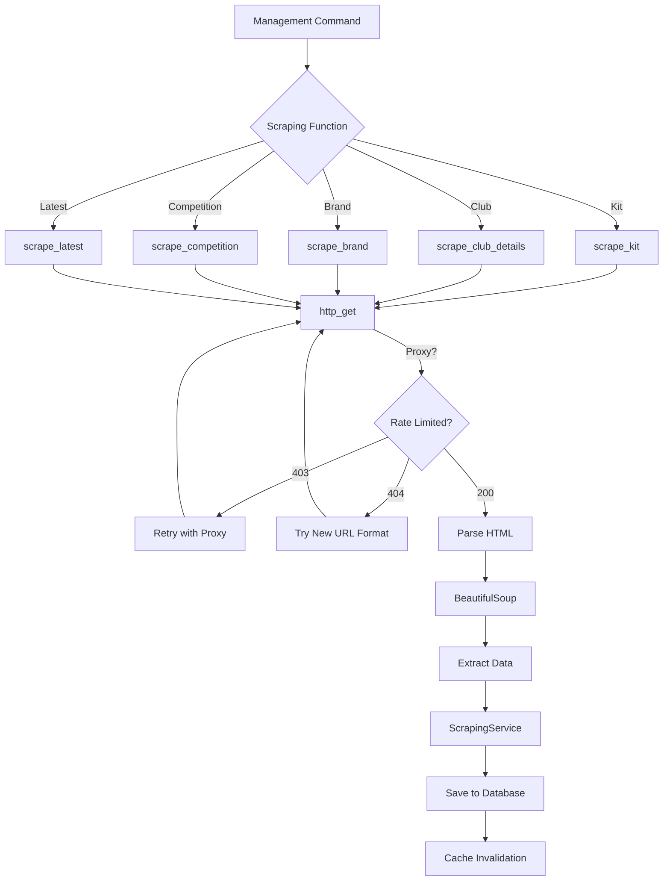
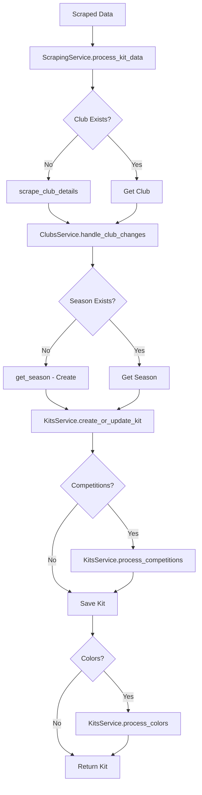

## Overview

FKApi scrapes football kit data from [footballkitarchive.com](https://footballkitarchive.com) using a robust, ethical scraping system built with Python's `requests` and `BeautifulSoup4` libraries. The system includes retry logic, proxy support, rate limiting, and comprehensive error handling.

All scraping logic is in `fkapi/core/scrapers.py` (~1400 lines).

## Architecture



## Core Scraping Functions

### scrape_kit()

Scrapes a single kit using its slug and optional kit_id.

<ParamField path="slug" type="str" required>
  The kit's base slug from the URL (e.g., "barcelona-2024-25-home-kit")
</ParamField>

<ParamField path="kit_id" type="str">
  Kit ID for new URL format (e.g., "402174")
</ParamField>

<ParamField path="use_proxy" type="bool" default="False">
  Whether to use a proxy for the request
</ParamField>

<ParamField path="existing_kit_id" type="int">
  ID of existing kit to update (instead of creating new)
</ParamField>

**Returns:** `Kit | None` - Created/updated Kit object or None if failed

**Features:**
- Automatic retry with exponential backoff (max 3 retries)
- Handles URL format changes (old vs new format)
- 403 detection triggers automatic proxy use
- 404 handling with new URL format fallback
- Validates page existence before parsing

<CodeGroup>
```python Usage
from core.scrapers import scrape_kit

# Basic usage
kit = scrape_kit('barcelona-2024-25-home-kit')

# With kit_id (new URL format)
kit = scrape_kit('barcelona-2024-25-home-kit', kit_id='402174')

# With proxy
kit = scrape_kit('kit-slug', use_proxy=True)

# Update existing kit
kit = scrape_kit('kit-slug', existing_kit_id=123)
```
</CodeGroup>

---

### scrape_club_details()

Scrapes club information including name, logo, and country.

<ParamField path="slug" type="str" required>
  The club's slug (e.g., "barcelona")
</ParamField>

<ParamField path="use_proxy" type="bool" default="False">
  Whether to use a proxy
</ParamField>

**Returns:** `Club | None`

**Extracted Data:**
- Club name (from page title)
- Logo URL (both light and dark mode)
- Creates or updates Club record

<CodeGroup>
```python Usage
from core.scrapers import scrape_club_details

club = scrape_club_details('barcelona')
print(club.name)  # "FC Barcelona"
print(club.logo)  # Logo URL
```
</CodeGroup>

---

### scrape_whole_club()

Scrapes all kits for a given club across all seasons. Always uses proxy to prevent IP bans.

<ParamField path="club" type="Club" required>
  The Club model instance to scrape
</ParamField>

**Returns:** `Club | None`

**Process:**
1. Fetches club's kit archive page
2. Iterates through each season container
3. Extracts brand information
4. Processes each kit in the season
5. Uses atomic transactions for data integrity

<Warning>
  This function always uses a proxy since it makes many requests in sequence. Expect longer execution time.
</Warning>

<CodeGroup>
```python Usage
from core.models import Club
from core.scrapers import scrape_whole_club

club = Club.objects.get(slug='barcelona')
result = scrape_whole_club(club)
# Scrapes all Barcelona kits from all seasons
```
</CodeGroup>

---

### scrape_latest()

Scrapes the "Latest Kits" page to find newly added kits.

<ParamField path="page" type="int" default="1">
  Page number to scrape
</ParamField>

<ParamField path="use_proxy" type="bool" default="False">
  Whether to use a proxy
</ParamField>

**Returns:** `tuple[bool, bool]` - (success, all_kits_exist)

**Behavior:**
- Checks if kits already exist in database
- Only queues new kits for scraping
- Returns early if all kits on page exist
- Dispatches scraping to Celery tasks for parallel processing

<CodeGroup>
```python Usage
from core.scrapers import scrape_latest

# Scrape page 1
success, all_exist = scrape_latest(page=1)

if all_exist:
    print("All kits already in database")
else:
    print("Found new kits")
```
</CodeGroup>

---

### scrape_latest_pages()

Scrapes multiple pages from the latest kits section.

<ParamField path="page_start" type="int" default="1">
  First page to scrape
</ParamField>

<ParamField path="page_end" type="int" default="1">
  Last page to scrape
</ParamField>

<ParamField path="use_proxy" type="bool" default="False">
  Whether to use a proxy
</ParamField>

<ParamField path="delay" type="int" default="2">
  Delay in seconds between pages
</ParamField>

<ParamField path="progress_callback" type="callable">
  Optional callback function for progress reporting
</ParamField>

<ParamField path="reverse_order" type="bool" default="False">
  Process pages in reverse order (newest to oldest)
</ParamField>

**Returns:** `tuple[int, int]` - (success_count, failure_count)

<CodeGroup>
```python Usage
from core.scrapers import scrape_latest_pages

# Scrape pages 1-10
success, failed = scrape_latest_pages(
    page_start=1,
    page_end=10,
    use_proxy=True,
    delay=3
)

print(f"Success: {success}, Failed: {failed}")
```
</CodeGroup>

---

## HTTP Layer

### http_get()

Centralized HTTP request function with retry logic and proxy support (defined in `core/http.py`).

**Features:**
- Automatic retries on failure
- Rotating proxy support
- Custom headers (User-Agent, Accept, etc.)
- Connection pooling
- Timeout handling

<CodeGroup>
```python Implementation Pattern
from core.http import http_get
from core.constants import BASE_URL

url = f"{BASE_URL}/barcelona-2024-25-home-kit"

# Basic request
response = http_get(url)

# With proxy
response = http_get(url, use_proxy=True)

# With custom headers
response = http_get(url, headers={'Accept': 'application/json'})
```
</CodeGroup>

---

## HTML Parsing

### BeautifulSoup4

All HTML parsing uses BeautifulSoup4 with the `lxml` parser:

```python
from bs4 import BeautifulSoup
from core.constants import HTML_PARSER  # "lxml"

soup = BeautifulSoup(response.text, HTML_PARSER)
```

### Common Extraction Patterns

<AccordionGroup>
  <Accordion title="Extract Kit Name" icon="tag">
    ```python
    title_elem = soup.find("span", class_="main-title")
    kit_name = title_elem.text.strip()
    ```
  </Accordion>
  
  <Accordion title="Extract Logo" icon="image">
    ```python
    def _parse_main_header_logo(main_header):
        logo_img = main_header.find("img")
        if not logo_img or "data-src" not in logo_img.attrs:
            raise ValueError("Logo image not found")
        logo_path = logo_img["data-src"].lstrip("/")
        logo_url = f"{BASE_URL.rstrip('/')}/{logo_path}"
        
        # Handle light/dark variants
        if "_l" in logo_url:
            return logo_url.replace("_l", ""), logo_url
        return logo_url, None
    ```
  </Accordion>
  
  <Accordion title="Extract Fact Table" icon="table">
    ```python
    from core.parsers import extract_fact_table
    
    soup = BeautifulSoup(html, HTML_PARSER)
    data = extract_fact_table(soup)
    
    # Returns structured data including:
    # - kit_name
    # - brand
    # - season
    # - competition
    # - colors
    # - design
    # - rating
    ```
  </Accordion>
  
  <Accordion title="Extract Kit Details" icon="info">
    ```python
    from core.parsers import parse_kit_page
    
    data = parse_kit_page(soup)
    # Returns complete kit data dictionary
    ```
  </Accordion>
</AccordionGroup>

---

## Error Handling

### Exception Hierarchy

Custom exceptions defined in `core/exceptions.py`:

<CardGroup cols={2}>
  <Card title="ScrapingError" icon="triangle-exclamation">
    Base exception for scraping errors
  </Card>
  <Card title="KitNotFoundError" icon="ban">
    Kit page not found (404)
  </Card>
  <Card title="ClubNotFoundError" icon="ban">
    Club page not found (404)
  </Card>
  <Card title="RateLimitExceededError" icon="gauge-high">
    Rate limit exceeded (403)
  </Card>
  <Card title="InvalidSeasonError" icon="calendar-xmark">
    Invalid season format
  </Card>
</CardGroup>

### Retry Logic

<Steps>
  <Step title="Initial Request">
    Make HTTP request to target URL
  </Step>
  
  <Step title="Check Response">
    - 200: Success, proceed to parse
    - 403: Rate limited, retry with proxy
    - 404: Page not found, try URL format fallback
    - Other errors: Retry with backoff
  </Step>
  
  <Step title="Retry with Backoff">
    - Max retries: 3 (from `MAX_RETRIES` constant)
    - Retry delay: 2 seconds (from `RETRY_DELAY` constant)
    - Each retry increments counter
  </Step>
  
  <Step title="Final Attempt">
    If all retries exhausted, return None or raise exception
  </Step>
</Steps>

<CodeGroup>
```python Retry Pattern
max_retries = MAX_RETRIES  # 3
retry_count = 0

while retry_count < max_retries:
    try:
        response = http_get(url, use_proxy=use_proxy)
        
        if response.status_code == 403:
            logger.warning("Rate limited, retrying with proxy")
            use_proxy = True
            retry_count += 1
            time.sleep(RETRY_DELAY)
            continue
            
        response.raise_for_status()
        # Process successful response
        break
        
    except requests.exceptions.RequestException as e:
        logger.error(f"Request failed: {e}")
        retry_count += 1
        if retry_count == max_retries:
            return None
        time.sleep(2)
```
</CodeGroup>

---

## Rate Limiting & Proxies

### Ethical Scraping Practices

<Warning>
  Always respect the source website's rate limits and terms of service.
</Warning>

**Built-in Protections:**

1. **Delay Between Requests**
   - `scrape_latest_pages()` enforces configurable delay (default 2 seconds)
   - `scrape_user_collection_api()` uses 0.5 second delay between pages

2. **Automatic Proxy Use**
   - 403 responses trigger automatic proxy retry
   - Bulk operations (`scrape_whole_club`) always use proxy
   - Proxy rotation prevents IP bans

3. **Request Throttling**
   - Celery task queue prevents overwhelming the server
   - Tasks process kits sequentially or in controlled parallelism

### Proxy Configuration

Proxy settings are configured in environment variables (specifics in deployment config).

<CodeGroup>
```python Proxy Usage Pattern
# Automatic proxy on rate limit
if response.status_code == 403:
    use_proxy = True
    retry_request()

# Force proxy for bulk operations
def scrape_whole_club(club):
    response = http_get(url, use_proxy=True)
```
</CodeGroup>

---

## URL Format Handling

### Old vs New Format

FootballKitArchive.com uses two URL formats:

<Tabs>
  <Tab title="Old Format">
    ```
    /kit-slug-with-trailing-number123
    ```
    
    Example: `/barcelona-2024-25-home-kit402174`
    
    The trailing digits were part of the slug.
  </Tab>
  
  <Tab title="New Format">
    ```
    /kit-slug/kit-id/
    ```
    
    Example: `/barcelona-2024-25-home-kit/402174/`
    
    The ID is separated from the slug.
  </Tab>
</Tabs>

### Automatic Conversion

The `_try_new_url_format()` function automatically detects and converts:

```python
def _split_slug_trailing_digits(slug: str) -> tuple[str, str] | None:
    """Split slug into (base, trailing_digits) if it ends with digits."""
    if not slug or not slug[-1].isdigit():
        return None
    i = len(slug) - 1
    while i >= 0 and slug[i].isdigit():
        i -= 1
    if i < len(slug) - 1:
        return slug[: i + 1], slug[i + 1 :]
    return None

# Usage
base_slug, kit_id = _split_slug_trailing_digits(
    'barcelona-2024-25-home-kit402174'
)
# Returns: ('barcelona-2024-25-home-kit', '402174')
```

### URL Building

```python
def build_kit_url(slug: str, kit_id: str | None = None) -> str:
    """Builds the complete URL for scraping a kit."""
    if kit_id:
        return f"{BASE_URL}/{slug}/{kit_id}/"
    
    split = _split_slug_trailing_digits(slug)
    if split:
        base_slug, extracted_id = split
        return f"{BASE_URL}/{base_slug}/{extracted_id}/"
    
    return f"{BASE_URL}/{slug}"
```

---

## Season Parsing

### Season Format Variations

The scraper handles multiple season input formats:

| Input Format | Normalized | first_year | second_year |
|--------------|-----------|------------|-------------|
| `2024` | `2024` | `2024` | `None` |
| `23-24` | `2023-24` | `2023` | `2024` |
| `2023-24` | `2023-24` | `2023` | `2024` |
| `2023-2024` | `2023-2024` | `2023` | `2024` |
| `99-00` | `1999-00` | `1999` | `2000` |

### get_season()

Parses season from kit slugs:

```python
def get_season(season_slug: str) -> Season:
    """
    Retrieves or creates a Season object from a slug.
    
    Handles:
    - Full kit slugs: 'barcelona-2023-24-home-kit'
    - Direct years: '2024', '2023-24', '99-00'
    - Carry-over removal: '2023-24 (carry-over)' -> '2023-24'
    """
    slug = _normalize_season_slug(season_slug)
    
    # Try two-digit year format (99-00)
    parsed = _parse_two_digit_year(slug)
    if parsed:
        year_str, first_year, second_year = parsed
        return _get_or_create_season(year_str, first_year, second_year)
    
    # Try direct year format (2024, 2023-24)
    parsed = _parse_direct_year(slug)
    if parsed is None:
        # Extract from full kit slug
        parsed = _parse_year_from_kit_slug(slug)
    
    year_str, first_year, second_year = parsed
    _validate_season_years(season_slug, first_year, second_year)
    return _get_or_create_season(year_str, first_year, second_year)
```

### Year Validation

<AccordionGroup>
  <Accordion title="Valid Range" icon="calendar-check">
    - Years must be between 1800-2100
    - Prevents obvious input errors
    - Historical and future seasons supported
  </Accordion>
  
  <Accordion title="Span Validation" icon="calendar-range">
    - Modern seasons (1960+): Max 2-year span
    - Historical seasons (pre-1960): Max 20-year span
    - Prevents incorrect season parsing
  </Accordion>
  
  <Accordion title="Order Validation" icon="arrow-up-1-9">
    - second_year must be ≥ first_year
    - Catches reversed or invalid input
  </Accordion>
</AccordionGroup>

---

## API Scraping

In addition to HTML scraping, FKApi can scrape from FootballKitArchive's internal APIs.

### scrape_user_collection_api()

Scrapes a user's kit collection using the collection-feed API:

<ParamField path="userid" type="int" required>
  User ID from FootballKitArchive
</ParamField>

**Returns:** `dict` with:
- `success`: bool
- `entries`: list of kit entries
- `total_entries`: int
- `pages_scraped`: int
- `user`: user info dict (if available)

**Features:**
- Automatic pagination (fetches all pages)
- Filters out custom entries (custom_team, custom_type, etc.)
- Cleans unwanted fields from response
- 0.5 second delay between pages
- Returns enriched data with metadata

<CodeGroup>
```python Usage
from core.scrapers import scrape_user_collection_api

data = scrape_user_collection_api(userid=12345)

print(f"Total entries: {data['total_entries']}")
print(f"Pages scraped: {data['pages_scraped']}")

for entry in data['entries']:
    print(entry['kit']['name'])
```
</CodeGroup>

### scrape_user_info_api()

Scrapes user profile information:

<ParamField path="userid" type="int" required>
  User ID from FootballKitArchive
</ParamField>

**Returns:** `dict | None` with user data:
- `id`: User ID
- `name`: Username
- `image`: Profile image URL
- Additional profile fields

---

## Data Processing Flow

### ScrapingService.process_kit_data()

The central processing function for scraped kit data:



### Transaction Management

All scraping operations use atomic transactions:

```python
from django.db import transaction

with transaction.atomic():
    club.save()
    kit.save()
    kit.competition.add(*competitions)
    # All-or-nothing: Rolls back on any error
```

---

## Constants

Scraping configuration constants (defined in `core/constants.py`):

| Constant | Value | Purpose |
|----------|-------|----------|
| `BASE_URL` | `https://www.footballkitarchive.com` | Base website URL |
| `MAX_RETRIES` | `3` | Maximum retry attempts |
| `RETRY_DELAY` | `2` | Seconds between retries |
| `HTTP_STATUS_FORBIDDEN` | `403` | Rate limit status code |
| `HTML_PARSER` | `lxml` | BeautifulSoup parser |
| `KIT_CLASS` | `archive-result` | CSS class for kit elements |
| `KIT_CONTAINER_CLASS` | `archive-results-grid` | CSS class for kit grid |
| `COLLECTION_CONTAINER_CLASS` | `collection-container` | CSS class for season containers |
| `SECTION_DETAILS_CLASS` | `section-details` | CSS class for section details |
| `KIT_SEASON_CLASS` | `kit-season` | CSS class for kit season |
| `LATEST_PAGE_URL` | `/latest/` | Latest kits page path |
| `DEFAULT_LOGO_URL` | `/static/logos/not_found.png` | Fallback logo |

---

## Celery Integration

For parallel processing and scheduled scraping:

### Task Definitions

<CodeGroup>
```python Task Example
from celery import shared_task
from core.scrapers import scrape_kit

@shared_task(bind=True, max_retries=3)
def scrape_kit_task(self, slug, kit_id=None, use_proxy=False):
    """Celery task for scraping a single kit."""
    try:
        kit = scrape_kit(slug, kit_id=kit_id, use_proxy=use_proxy)
        return kit.id if kit else None
    except Exception as exc:
        # Retry with exponential backoff
        raise self.retry(exc=exc, countdown=60 * (2 ** self.request.retries))
```
</CodeGroup>

### Scheduled Scraping

Configured in `settings.py`:

```python
CELERY_BEAT_SCHEDULE = {
    'scrape_daily': {
        'task': 'core.tasks.scrape_daily',
        'schedule': crontab(hour=0, minute=0),  # Midnight daily
    },
}
```

---

## Logging

Scraping operations use Python's logging module:

```python
import logging

logger = logging.getLogger(__name__)

logger.debug(f"Scraping kit: {slug}")
logger.info(f"Successfully created kit: {kit.name}")
logger.warning(f"Rate limited, retrying with proxy")
logger.error(f"Failed to scrape kit: {slug}")
```

**Log Levels:**
- `DEBUG`: Detailed scraping progress
- `INFO`: Successful operations
- `WARNING`: Recoverable errors (rate limits, retries)
- `ERROR`: Failed operations

---

## Best Practices

<CardGroup cols={2}>
  <Card title="Use Proxies for Bulk" icon="shield">
    Always enable proxies when scraping multiple pages or entire clubs
  </Card>
  
  <Card title="Respect Rate Limits" icon="gauge">
    Use appropriate delays between requests (2+ seconds recommended)
  </Card>
  
  <Card title="Handle Errors Gracefully" icon="circle-exclamation">
    Use try-except blocks and return None on failure
  </Card>
  
  <Card title="Use Transactions" icon="lock">
    Wrap database operations in atomic transactions
  </Card>
  
  <Card title="Log Everything" icon="file-lines">
    Comprehensive logging helps debug scraping issues
  </Card>
  
  <Card title="Validate Data" icon="check">
    Always validate scraped data before saving
  </Card>
</CardGroup>

<Warning>
  **Important:** Always check `robots.txt` and respect the source website's terms of service. FKApi is designed for educational and archival purposes.
</Warning>

---

## Troubleshooting

<AccordionGroup>
  <Accordion title="403 Forbidden Errors" icon="ban">
    **Cause:** Rate limiting by the source website
    
    **Solution:**
    - Enable proxy: `use_proxy=True`
    - Increase delay between requests
    - Check if IP is banned
    - Use Celery for distributed scraping
  </Accordion>
  
  <Accordion title="404 Not Found Errors" icon="magnifying-glass">
    **Cause:** Page moved or URL format changed
    
    **Solution:**
    - Scraper automatically tries new URL format
    - Verify slug is correct
    - Check if kit exists on website
    - Use `kit_id` parameter if available
  </Accordion>
  
  <Accordion title="Parsing Errors" icon="code">
    **Cause:** HTML structure changed on source website
    
    **Solution:**
    - Update CSS selectors in `core/parsers.py`
    - Check `KIT_CLASS`, `SECTION_DETAILS_CLASS` constants
    - Verify BeautifulSoup selectors
  </Accordion>
  
  <Accordion title="Season Parsing Issues" icon="calendar">
    **Cause:** Unusual season format
    
    **Solution:**
    - Check `get_season()` logic
    - Add new format handler in `_parse_*_year()` functions
    - Validate year ranges (1800-2100)
  </Accordion>
  
  <Accordion title="Database Integrity Errors" icon="database">
    **Cause:** Missing foreign key relationships
    
    **Solution:**
    - Ensure clubs, brands, seasons exist before creating kits
    - Use `scrape_club_details()` to create missing clubs
    - Use `get_season()` to auto-create seasons
    - Wrap operations in `transaction.atomic()`
  </Accordion>
</AccordionGroup>

---

## Related Documentation

<CardGroup cols={2}>
  <Card title="Architecture" icon="diagram-project" href="/concepts/architecture">
    Understand overall system architecture
  </Card>
  <Card title="Data Models" icon="database" href="/concepts/data-models">
    Learn about database models
  </Card>
</CardGroup>
